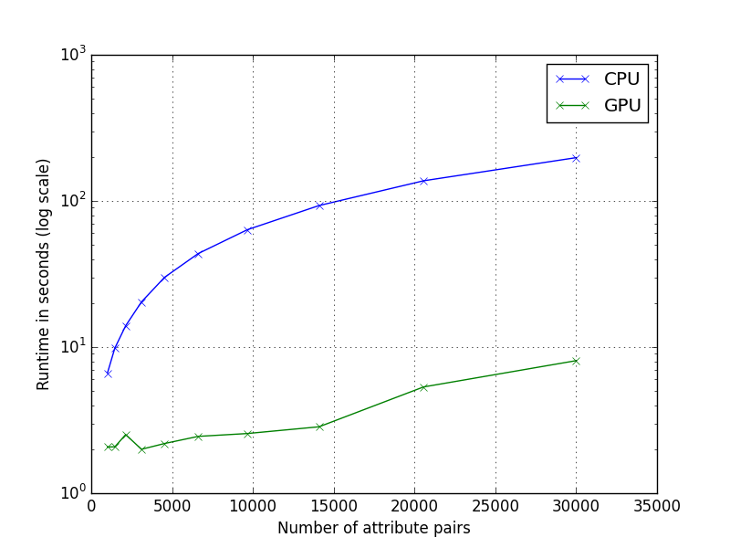

VizRank CPU vs. GPU benchmark
=============================

We wish to measure the runtime of various implementations of the VizRank
algorithm.  The benchmark is performed on a i7 3770 CPU and GTX Titan GPU.

Competing Implementations
-------------------------

- main.py: Python reference implementation. This is extremely slow and does not appear on the graphs.
- main.c: C implementation running on one core.
- main.cu: CUDA implementation parallelized over pairs of attribute (first loop in pseudocode). 

VizRank Algorithm
-----------------

Input:
- X: NUM_EXAMPLES x NUM_ATTRS matrix; dataset
- Y: NUM_EXAMPLES vector; labels
- P: NUM_PAIRS x 2 matrix; pairs of attributes to score
- NUM_NEIGHBORS: int; number of neighbors in kNN algorithm

Output:
- S: NUM_PAIRS vector; VizRank score for each pair in P

Psedocode:

	S = []
 	for each attribute pair attr1, attr2 in P:
 		score = 0
 		for each example i:
			neighbors = list of NUM_NEIGHBORS nearest neighbors of example i 
                        when taking only attr1 and attr2 under consideration
            score += number of neighbors with same class label as example i
        S.append(score)
        
Results
-------

We plot CPU and GPU runtimes when we vary the number of attribute pairs to
score. The GPU implementation is roughly 25 times faster.

	NUM_ATTRS = 1000
	NUM_EXAMPLES = 1000
	NUM_NEIGHBORS = 5
	NUM_PAIRS = 1000 .. 30000

