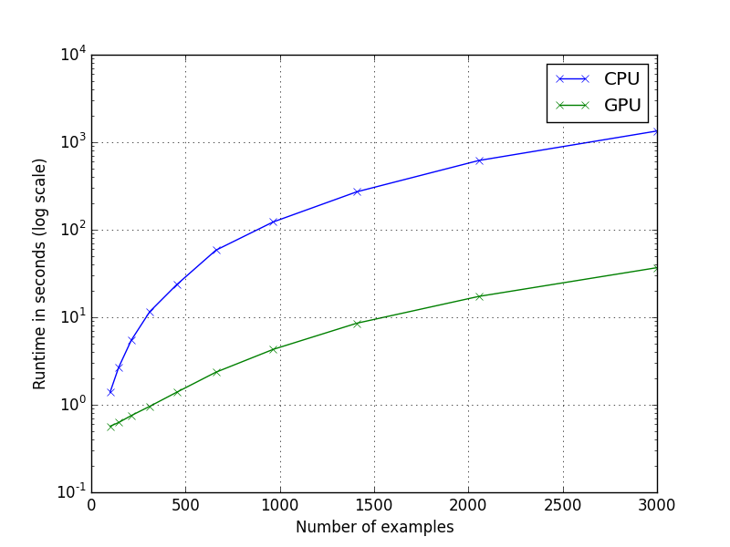
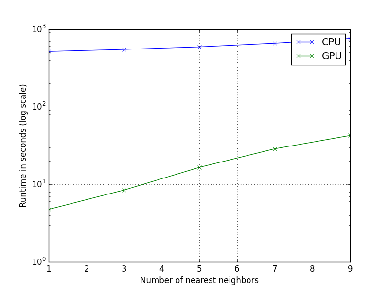

VizRank CPU vs. GPU benchmark
=============================

We measure the runtime of two implementations of the VizRank algorithm:

- a single core CPU implementation written in C
- a GPU implementation written in CUDA

We found the GPU implementation is up to 100 times faster than the CPU
implementation on our machine, depending on the parameters (sizo of the dataset
and number of attribute pairs to score).

Competing implementations
-------------------------

- main.py: Python reference implementation. This is extremely slow and does not appear on the graphs.
- main.c: C implementation running on one core.
- main.cu: CUDA implementation parallelized over pairs of attribute (first loop in pseudocode). 

The outputs of all three implementations are identical.

VizRank algorithm
-----------------

Input:
- X: NUM_EXAMPLES x NUM_ATTRS matrix; dataset
- Y: NUM_EXAMPLES vector; labels
- P: NUM_PAIRS x 2 matrix; pairs of attributes to score
- NUM_NEIGHBORS: int; number of neighbors in kNN algorithm

Output:
- S: NUM_PAIRS vector; VizRank score for each pair in P

Psedocode:

	S = []
 	for each attribute pair attr1, attr2 in P:
 		score = 0
 		for each example i:
			neighbors = list of NUM_NEIGHBORS nearest neighbors of example i 
                        when taking only attr1 and attr2 under consideration
            score += number of neighbors with same class label as example i
        S.append(score)
        
Results
-------

The benchmark is performed on a i7 3770 CPU and GTX Titan GPU. We are measuring
the execution time of the entire program, which includes loading the data into
CPU and GPU memory.

### Number of attribute pairs ###

We first plot CPU and GPU runtimes while varying the number of attribute pairs
to score. The GPU implementation is up to 25 times faster.

	NUM_ATTRS = 1000
	NUM_EXAMPLES = 1000
	NUM_NEIGHBORS = 5
	NUM_PAIRS = 1000 .. 30000

### Number of examples ###

Here we plot CPU and GPU runtimes while varying the number of examples in the
dataset.  The GPU implementation is up to 35 times faster.

	NUM_ATTRS = 1000
	NUM_EXAMPLES = 100 .. 3000
	NUM_NEIGHBORS = 5
	NUM_PAIRS = 20000

### Number of nearest neighbors ###

Lastly, we plot CPU and GPU runtimes while varying the number of nearest neighbors.
The GPU implementation is from 20 to 100 times faster.

	NUM_ATTRS = 1000
	NUM_EXAMPLES = 2000
	NUM_NEIGHBORS = 1 .. 9
	NUM_PAIRS = 20000

